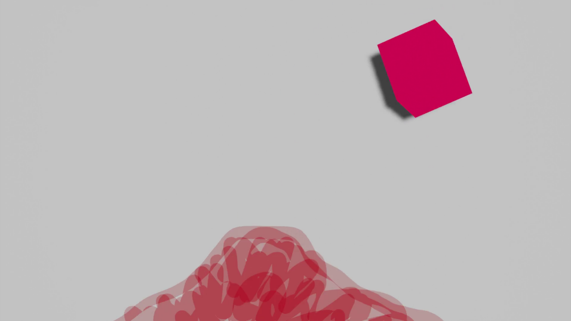

## Descripción técnica y tecnológica del proyecto

#### Técnica visual

Realización en Blender, usando animación 3d mixta con animación 2d tradicional-digital.
Para conseguir un estilo abstracto 3d, realizaremos un uso de shaders minimalista. Esto lo conseguiremos mediante el lenguaje visual Shader Nodes de Blender.

La edición y postproducción es realizada en Adobe Premiere.

#### Técnica de audio

Usaremos VCVRack para generar efectos de sonido y música.

Editamos los samples obtenidos con Adobe Premiere.